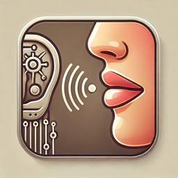

# Secret Friend



A versatile interface to interact with local LLMs through Ollama, with voice activation and text-to-speech feedback.

## Overview

Secret Friend is a Python script that allows you to have a voice conversation with LLMs running on your local machine via [Ollama](https://ollama.ai/). You can interact with it using voice commands, command-line arguments, or text input, and the LLM's responses are spoken aloud using macOS's built-in text-to-speech capability.

## Requirements

- macOS (for the built-in `say` command)
- Python 3.x
- [Ollama](https://ollama.ai/) installed and running locally with at least one model
- For voice activation: `vosk`, `sounddevice`, and `numpy` Python packages
- A Vosk speech recognition model (downloadable from their website)

## Setup

1. Clone this repository:
   ```bash
   git clone https://github.com/smurp/secretfriend.git
   cd secretfriend
   ```

2. Create and activate a virtual environment:
   ```bash
   python -m venv venv
   source venv/bin/activate
   ```

3. Install the required packages:
   ```bash
   pip install -r requirements.txt
   ```

4. Download a Vosk speech recognition model:
   ```bash
   wget https://alphacephei.com/vosk/models/vosk-model-small-en-us-0.15.zip
   unzip vosk-model-small-en-us-0.15.zip
   ```
   
   Note: You can choose different models from https://alphacephei.com/vosk/models based on your needs:
   - Small models work well for command recognition but have less accuracy
   - Larger models are more accurate but use more resources

5. Make sure Ollama is installed and running:
   ```bash
   # Check if Ollama is running
   curl http://localhost:11434/api/tags
   
   # If not running, start Ollama in a separate terminal
   ollama serve
   ```

6. Pull at least one model if you haven't already:
   ```bash
   ollama pull gemma2:latest
   # or any other model you prefer
   ```

7. Make the script executable:
   ```bash
   chmod +x secretfriend.py
   ```

## Usage

Secret Friend offers multiple ways to interact:

### Voice Activation Mode (Default)

1. Run the script:
   ```bash
   ./secretfriend.py
   ```

2. Say "listen up" to activate the assistant (or your custom wake phrase).

3. Secret Friend will respond with "yes" and listen for your command.

4. Speak your question or prompt, then say "go for it" when you're done.
   (Alternatively, a 5-second pause will also end your command)

5. The script will send your prompt to the local LLM and speak the response.

6. After the response is spoken, the assistant will automatically listen for your next command
   without requiring you to say the wake phrase again.

7. To exit the conversation completely, say "that will do" (or your custom done phrase).

8. Alternatively, press Ctrl+C to exit the program at any time.

### Command-Line Options

Secret Friend supports a variety of command-line options:

```bash
# Start in voice mode (default)
./secretfriend.py

# Start in CLI mode
./secretfriend.py --cli

# Execute a command directly
./secretfriend.py --command "list models"

# Send text directly to the LLM
./secretfriend.py tell me a joke

# Start CLI mode with an initial query
./secretfriend.py --cli tell me a joke

# Set custom wake and end phrases
./secretfriend.py --hi "hey you" --go "off you go"

# Set the conversation exit phrase
./secretfriend.py --done "conversation over"

# Combine options
./secretfriend.py --hi "computer" --go "that's all" --done "goodbye" tell me a joke

# Show help
./secretfriend.py --help
```

## Special Commands

Secret Friend supports special system commands that bypass the LLM. To use these, wrap your command with the PRE_COMMAND and POST_COMMAND phrases:

```
[PRE_COMMAND] [command] [POST_COMMAND]
```

For example, with default settings:
```
hocus pocus list models abracadabra
```

Or with custom settings from .env.example:
```
oh great genie list models let it be done
```

Available special commands:
- `list models` - Shows available Ollama models
- `exit` - Exits the application

You can add more special commands by modifying the `process_command` function in the script.

## Features

- Uses locally running LLMs via Ollama
- Fully offline voice activation with configurable wake phrase (default: "listen up")
- Offline speech recognition for hands-free operation using Vosk
- Text-to-speech output using macOS's built-in `say` command
- Special system commands using the pre/post command pattern
- Multiple command-line interaction options
- Automatically detects available models
- Cleans LLM responses for better speech output

## Configuration

You can configure Secret Friend using environment variables or a `.env` file:

- `MODEL`: Specify which Ollama model to use (default: gemma2:latest)
- `VOSK_MODEL_PATH`: Path to your Vosk speech recognition model (default: vosk-model-small-en-us-0.15)
- `HI_PHRASE`: The phrase to activate the assistant (default: "listen up")
- `GO_PHRASE`: The phrase to end your command (default: "go for it")
- `DONE_PHRASE`: The phrase to exit the conversation (default: "that will do")
- `PRE_COMMAND`: The phrase that precedes special commands (default: "hocus pocus")
- `POST_COMMAND`: The phrase that follows special commands (default: "abracadabra")
- `COMMAND_TIMEOUT`: Maximum time in seconds to wait for a command (default: 30)
- `SILENCE_TIMEOUT`: Seconds of silence before automatically ending command (default: 5)

Examples:

```bash
# Run with a specific Ollama model
MODEL=deepseek-r1:32b ./secretfriend.py

# Run with a custom Vosk model path
VOSK_MODEL_PATH=/path/to/vosk-model-large ./secretfriend.py

# Use custom phrases
HI_PHRASE="computer" GO_PHRASE="done" PRE_COMMAND="execute" POST_COMMAND="now" ./secretfriend.py

# Or create a .env file with the configuration
echo "MODEL=deepseek-r1:32b" > .env
echo "VOSK_MODEL_PATH=/path/to/vosk-model" >> .env
echo "HI_PHRASE=jarvis" >> .env
echo "GO_PHRASE=done" >> .env
echo "PRE_COMMAND=run command" >> .env
echo "POST_COMMAND=end command" >> .env
./secretfriend.py
```

## Troubleshooting

### Voice Recognition Issues

If you're having trouble with voice recognition:

1. Make sure you have installed the required packages and downloaded a Vosk model:
   ```bash
   pip install vosk sounddevice numpy
   wget https://alphacephei.com/vosk/models/vosk-model-small-en-us-0.15.zip
   unzip vosk-model-small-en-us-0.15.zip
   ```

2. Try a larger model for better accuracy:
   ```bash
   wget https://alphacephei.com/vosk/models/vosk-model-en-us-0.22.zip
   unzip vosk-model-en-us-0.22.zip
   ./secretfriend.py --model-path vosk-model-en-us-0.22
   ```

3. Check your microphone settings and permissions:
   - Make sure your microphone is connected and working
   - Ensure your application has permission to access the microphone
   - Test with `arecord -l` on Linux or `system_profiler SPAudioDataType` on macOS

4. Speak clearly and in a quiet environment for better recognition

5. If you continue having issues, try using the CLI mode instead:
   ```bash
   ./secretfriend.py --cli
   ```

### Ollama Connection Issues

If you get an error like "Error communicating with Ollama API", check that:

1. Ollama is installed and running
   ```bash
   # Check if the Ollama process is running
   ps aux | grep ollama
   
   # Check if the API is responding
   curl http://localhost:11434/api/tags
   ```

2. If Ollama isn't running, start it in a separate terminal:
   ```bash
   ollama serve
   ```

3. Verify you have at least one model installed:
   ```bash
   ollama list
   ```

4. If no models are installed, pull one:
   ```bash
   ollama pull gemma2:latest
   # or
   ollama pull llama3
   ```

### Text-to-Speech Issues

If the responses appear but aren't being spoken:

1. Test if the macOS 'say' command works independently:
   ```bash
   say "This is a test"
   ```

2. Check for any error messages in the script output when it attempts to speak

3. Try running the script with a different terminal or shell if the speech isn't working

## Future Improvements

Future versions could include:
- Support for Windows and Linux text-to-speech (consider replacing macOS 'say' with Piper)
- Custom wake word training
- Better handling of long responses
- Interface improvements
- Custom system prompts
- Multi-language support through different Vosk models

## License

MIT License

## Acknowledgments

- [Ollama](https://ollama.ai/) for making local LLMs easy to use
- [Vosk](https://alphacephei.com/vosk/) for the offline speech recognition capabilities
- [sounddevice](https://python-sounddevice.readthedocs.io/) for audio processing
